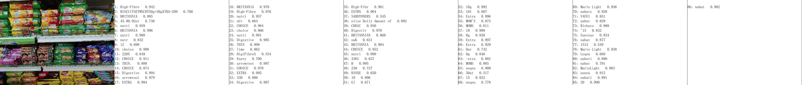
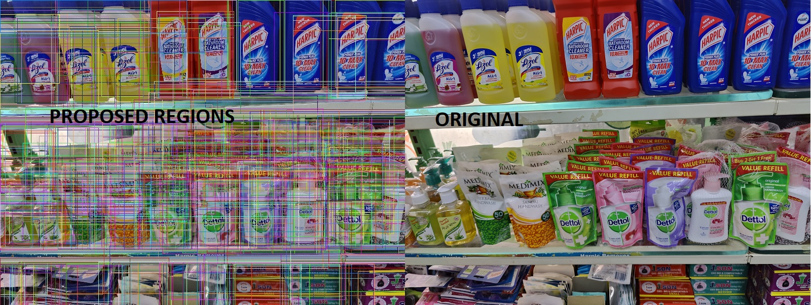

# Introduction
Hello,

This Repository contains our (Team Pixel) submission for #POSSIBILITIES Hackathon by ElasticRun powered by Microsoft and hosted on HackerEarth!

# Problem Statement
The problem statement that we selected was to identify the store size, product categories and products in an image.

# Our Solution / Submission

## Repository Structure

There are two folders in the solution:

1. The [Server](./server/rest_api_in_django) hosts a REST API server built with Django. It is used to process the image uploaded by the android app and send the response.

2. The [Pipeline](./pipeline) folder contains the pipeline script that is used by the server to process the image. It can be run individually by the following command. Make sure to comment out the relative imports from [pipeline.py](./pipeline/pipeline.py#L8)

```commandline
cd pipeline
python3 pipeline.txt
```

The solution should contain a product database saved under the products folder:
1. Each product's name becomes the folder name
2. Each folder can have more than one image
3. The product should be tight cropped
4. It should contain a cat.txt file which has the category of the product (example: biscuits, bakery, etc.)

Download the models and product images from [gdrive](#) link and unzip them in both server and pipeline

## Environment Setup

All the libraries that we used are listed in [environment_spec.txt](./environment_spec.txt)

## Step-1: Using Super Resolution
The first and foremost thing to do in any computer vision application is image processing

The problem with many images in the dataset is the image size and the lack of contrasting features

We used a super resolution network from [OpenVINO](https://github.com/openvinotoolkit/open_model_zoo/blob/master/demos/README.md)

The inference code can be found at [super_res.py](./pipeline/super_res.py)

## Step-2: Using OCR

We used OCR to try and detect the brand names or product names in the images

### Problems Faced
Since we used ocr, we are able to read not just brand names but everything that's not a product as well.



To solve this, we used a sequence matcher that maps every word with product names in our dataset to eliminate words that are not related.

The inference code can be found at [ocr_detect.py](./pipeline/ocr_detect.py)

The output images are saved to [saved_images](./readme_images)

## Step-3: Extracting Individual Products

## Approach-1: Using Selective Search

### Selective Search
Selective Search is a Region proposal network used in object detection. It was first published in 2012 and saying that it has revolutionalized the world of computer vision is putting it lightly.

### Problems Faced

The products are not made of one single color or texture as considered by SS algorithm. 

So we have to eliminate many Regions proposed by SS.



In order to do that, we used Non Max Suppression from OpenCV to remove boxes that are overlapping too much.

Even then, the regions may not be relevant, especially when there are people or vehicles in the image

To solve this, we used a [depth estimation model](https://docs.openvino.ai/2021.1/omz_models_public_midasnet_midasnet.html)


Inference code for depth estimation can be found at [estimate_depth.py](./pipeline/estimate_depth.py)

The inference code for region proposal can be found at [region_proposal.py](./pipeline/region_proposal.py)

## Approach-2: Using Object Detector

### Tiny Yolov3 trained on Our Images and SKU110K grocery dataset

We collected images from our local stores and included images from SKU110K to train a tiny-yolov3 model.

The model is only capable of identifying grocery products in a shelf.

### Problems Faced

The problem we faced is the model convergence, the data is very dynamic and we felt the large amount of data could take a while to train.

So we used a small subset of the SKU110K dataset and combined it with our dataset to train the model.

The inference code can be found at [yolo_detector.py](./pipeline/yolo_detector.py)

## Step-4: Identifying Products

Each region from Approach-1 & Approach-2 are cropped and passed through a feature extractor network.

The distance between the saved features and cropped regions' features are computed and the closest product is selected.

The algorithm can be found at [embedding_product_matcher.py](./pipeline/embedding_product_matcher.py)


